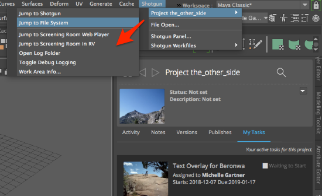
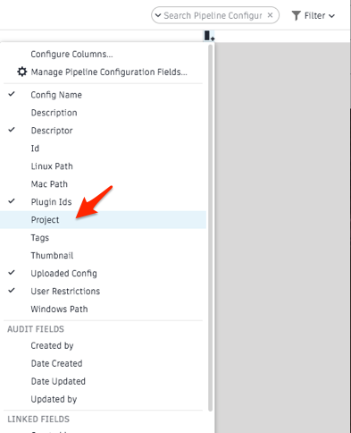
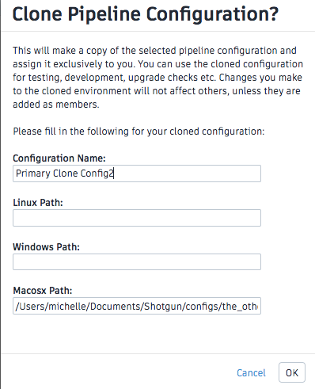
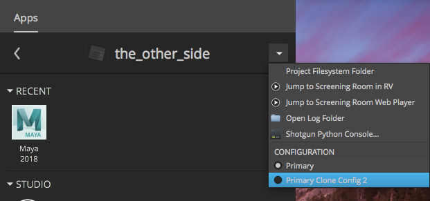
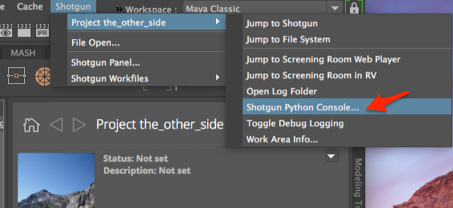

# Adding an app
 
By completing this guide, you will quickly become acquainted with the configuration management tools in Toolkit and learn how to:

* Safely create a copy of an active pipeline configuration
* Add an app to a configuration
* Add the settings necessary to use that app in specific environments
* Push your changes back to the active configuration

## About the guide

This guide will demonstrate how to add a Shotgun Toolkit app to an existing pipeline configuration. You will quickly become acquainted with the configuration management tools. 

The app we will be adding is the Shotgun Python Console app. Maya has its own Python console, but there are some features in the Toolkit app that don’t exist in the Maya console. 

This guide utilizes the pipeline configuration we created in the [Editing a Pipeline Configuration](./editing_app_setting.md) guide. If you haven’t completed this guide, you can use an existing pipeline configuration and add the app there.

## Using this document
 
To use this guide and install a Toolkit app, the following is required:

1. An active [Shotgun](https://www.shotgunsoftware.com/signup/) site.
2. A pipeline configuration for the identified project, or complete the [Getting Started with Configurations guide](./advanced_config.md) and use the configuration created in that exercise.
3. Read and write permissions set appropriately for the filesystem where the pipeline configuration is stored.
4. Shotgun Desktop installed on your system.
5. An active subscription for Maya. Get a 30 day trial of Maya [here](https://www.autodesk.com/products/maya/free-trial-dts). 



## About Shotgun Toolkit apps

### How Toolkit apps work

Apps that are referenced in pipeline configurations can be sourced from various locations. The apps that are standard in the Default Configuration are sourced from the Shotgun App Store. The files in a pipeline configuration specify how Shotgun integrations access an app, kind of like asking Toolkit, “Can you look in your little black book for the address of the Python Console App?” The pipeline configuration files tell Toolkit where to find the bundles of code that are utilized for a specific app.

The “addresses” for Toolkit Apps are listed in the `config/env/includes/app_locations.yml` file in the Default Configuration and specify how to find the code. These “addresses” are called [descriptors](https://developer.shotgunsoftware.com/tk-core/descriptor.html). The Shotgun integrations need to be told not only how to find the code bundles for the app, but also in what environment(s) to use the app.

Below is a conceptual overview of how to install an app and how to tell a Shotgun integration where to use it. It outlines the steps for extending the configuration, asking Toolkit to look up a descriptor, and telling Shotgun where to use the app. These steps are detailed in this guide:

1. Determine the descriptor for the app you want to add.
2. Make a copy of the active pipeline configuration you want to add the app descriptor to.
3. See if the app’s descriptor exists in the configuration and if not, add it.
4. Format the YAML file correctly using spaces and not tabs for indents.
5. Determine in what environment(s) the app is to be used.
6. Within those environment(s), add the setting that will allow Shotgun to use the app.
7. Test the new configuration.
8. Push the extended configuration live.

### Find the location descriptor for the Python Console App

**Step 1:** Open the [Apps and Engines page](https://support.shotgunsoftware.com/hc/en-us/articles/219039798-Applications-that-Toolkit-Integrates-with#tk-maya) and find the information for the Shotgun Python Console under Maya. Select the title.


This will bring up the [information for the app](https://support.shotgunsoftware.com/hc/en-us/articles/219033108), which includes everything that’s needed for the little black book.


The **System Name** is the main identifier: `tk-multi-pythonconsole`. You will also need the **Latest Version:** v1.1.2.

### Confirm that there’s no Python Console app in the Project environment in Maya

**Step 2:** Launch Maya and select the Shotgun Menu, **Shotgun > Project the_other_side** and you will see the list of apps that are available for that project in the Project environment.



## Extend the configuration

To edit a configuration that’s in production, you’ll want to first create a copy, then edit the copy. This way you don’t affect the live configuration and you can create a safe space to test it before pushing it live. Creating a staging sandbox allows you to play with a copy of the pipeline configuration currently being used in production. In the sandbox, you make changes to the copy of the configuration and test the changes before pushing the changes live into production.

Cloning a pipeline configuration automates the process of creating a copy, building a sandbox where you can play with the copy, before pushing the new configuration to the live production.

## Clone the Pipeline Configuration you want to add an app to

### Go to the Pipeline Configuration list. 

**Step 3:** Open Shotgun and in the upper right, select the **Admin Menu (your avatar) > Default Layouts > Pipeline Configuration > Pipeline Configuration List**.


This action displays a detailed list of all of your Shotgun site's pipeline configurations.

**Step 4:** Once the Pipeline Configuration List is displayed, select the **+** sign on the far right of the column headers, and add the column **Projects**.



### Review where the project’s configuration is located

**Step 5:**  Additionally, add the the appropriate **Path** field for your operating system.


This displays the paths to the configuration files.


**Step 6:** **Right-click** in the empty space next to the **Primary** line item and select **Clone this Configuration…** in the context menu.


**Step 7:** Name the configuration in the Configuration List and name the file in the directory: "Primary Clone Config 2" and “the_other_side_clone2,” respectively. Select **OK**. 



Wait while Shotgun copies all of the files and folders in the configuration and creates a cache for the apps. Now would be an opportune time to use an app that makes you a light, fluffy, melt in your mouth croissant to go with that perfect shot of espresso.


When completed, the Configuration List will be updated with information about the cloned configuration and there will be a new configuration added to your local config folder.



## Associate the cloned configuration with the project

**Step 8:** Open Shotgun Desktop and select the project you created the cloned configuration for. Select the **down arrow** in the upper right to display the configurations associated with this project and select the **Primary Clone Config 2** that you just created.



Shotgun Desktop is now using the cloned config for this project.

## Edit the Pipeline Configuration

**Step 9:** Find the cloned configuration on your file system, in the path you specified when you created it. View the `config/env/includes/app_locations.yml` file.


The `app_locations.yml` file is the Default Configuration’s little black book and the descriptors for apps are listed in this file. This file points to where the app is located and allows you to create settings for the app.

If an app that you want to use isn’t referenced in the little black book, you will need to tell Toolkit where to find it.

## Tell Toolkit where to find the app

**Step 10:** Search the file for `pythonconsole`. If you used the Default Configuration for the project, you will find that the descriptor for the Python Console app is listed in this file. It should match the description we found in the [list](https://support.shotgunsoftware.com/hc/en-us/articles/219039798-Integrations-Apps-and-Engines) of Maya apps we looked at when we started on our journey. Check to make sure the version matches what we looked at in the list of Maya apps. 

```yaml
apps.tk-multi-pythonconsole.location:
	type: app_store
	name: tk-multi-pythonconsole
	version: v1.1.2

```



All apps and engines have descriptors. You can read about how descriptors work and how to set the `type:` in the [Descriptor section of our Core API docs](https://developer.shotgunsoftware.com/tk-core/descriptor.html#descriptor-types).

## Tell Toolkit to use the descriptor

Now we need to tell Toolkit to use the descriptor to locate the Python Console app and use it when we’re in a Project environment in Maya.

**Step 11:** Open the `config/env/project.yml` file in your cloned config and find the settings for the `tk-maya` engine.

```yaml
# configuration for all engines to load in a project context

engines:
  tk-3dsmaxplus: "@settings.tk-3dsmaxplus.project"
  tk-desktop: "@settings.tk-desktop.project"
  tk-flame: "@settings.tk-flame.project"
  tk-hiero: "@settings.tk-nuke.hiero.project"
  tk-houdini: "@settings.tk-houdini.project"
  tk-mari: "@settings.tk-mari.project"
  tk-maya: "@settings.tk-maya.project"
  tk-motionbuilder: "@settings.tk-motionbuilder.project"
  tk-nuke: "@settings.tk-nuke.project"
  tk-nukestudio: "@settings.tk-nuke.nukestudio.project"
  tk-photoshopcc: "@settings.tk-photoshopcc.project"
  tk-shell: "@settings.tk-shell.project"
  tk-shotgun: "@settings.tk-shotgun.project"

```

The `tk-maya: “@settings.tk-maya.project”` line using the `@settings` tells you that the settings are in an included file. The `tk-maya` identifies the Maya engine and the `project` identifies the environment. 

### YAML files

The Shotgun Toolkit pipeline configuration uses simple terms in [YAML](https://yaml.org/spec/1.2/spec.html) files to identify the location of apps and engines, as well as their settings.

For this specific block:

* `settings` is what was chosen for the Default Configuration as a reference for the settings folder
* `project` is what was chosen for the Default Configuration as a reference for the project environment
* `tk-maya` is the identifier for Toolkit's engine for Maya
* `@` is a Toolkit term used to denote that a setting value is coming from an included file  

The YAML files are the windows into Shotgun’s integrations and make it easier to configure working environments that meet the needs of your pipeline. 

### How the configuration references Toolkit bundles

The code for Shotgun’s integrations is organized into bundles for apps, engines, and frameworks. The bundles are referenced in Toolkit’s YAML files using identifiers like `tk-maya`, `tk-multi-pythonconsole`, etc. Each bundle's corresponding block of YAML contains settings that control how the identified bundle is accessed and utilized.

## Where to put settings for the Python Console

For this specific block in the Default Configuration, ‘tk-maya.project’ is the identifier for the Maya engine in the project environment. Our goal is to add the Python Console app code bundle to the Maya engine in project environment. Based on the terms used, it’s a safe bet that `tk-maya.yml` is the name of the YAML file where settings for the project environment are located. Find the `settings.tk-maya.project` for `apps` in the `tk-maya.yml` file.

**Step 13:** To find the file, look for `tk-maya.yml` in the includes section above the engines.

`./includes/settings/tk-maya.yml`

**Step 14:** In your cloned configuration, open `config/env/includes/settings/tk-maya.yml` in a text editor, and search for `settings.tk-maya.project`. 


**Step 15:** Add the location descriptor under 

```yaml
settings.tk-maya.project:
  apps:
```

Use the `about` app, `tk-multi-about:`, as a guide for how to add the location descriptor, then save the file. 



```yaml
# project
settings.tk-maya.project:
  apps:
    tk-multi-about:
      location: "@apps.tk-multi-about.location"
    tk-multi-pythonconsole:
      location: "@apps.tk-multi-pythonconsole.location"
    tk-multi-screeningroom: "@settings.tk-multi-screeningroom.rv"
    tk-multi-shotgunpanel: "@settings.tk-multi-shotgunpanel"
    tk-multi-workfiles2: "@settings.tk-multi-workfiles2.launch_at_startup"
```
 
You will notice the **Screening Room, Shotgun Panel, and Workfiles2** app’s location identifiers are listed in a different included file and accessed differently than the **About** app. To keep things tidy, these apps were split off to the included settings folder because they have additional settings.

{% include info title="Note" content="The python console app already exists in the Default Configuration, however if you are adding an app that has never been added to your configuration before or if you have changed the version of an app, and you are using a [centralized configuration](https://developer.shotgunsoftware.com/tk-core/initializing.html#centralized-configurations), then there is an additional step you need to take. Open your terminal and browse to where your cloned configuration is stored. From your cloned configuration’s root folder, run the following command:<br/>

On Linux or Mac:

    ./tank cache_apps

On Windows:

    tank.bat cache_apps

This will scan your configuration for apps, engines and frameworks and ensure that they are all downloaded." %}

## View the changes in Maya

**Step 16:** Open Shotgun Desktop, select the project you were working with, and confirm you are using the cloned configuration. 

There will be a blue bar with the name of the clone that you created under the name of the project. 




**Step 17:** Launch Maya from Desktop and select the menu **Shotgun > Project > …**

If:

* You’re using the cloned configuration that you just edited
* The cloned configuration was extended correctly
* You saved the extended files
* You chose to associate the project with the cloned configuration
* You relaunched Maya from Shotgun Desktop

The Python Console app will be available in Maya.


## Push the changes into production

After confirming you added the Python Console app correctly, you’re ready to push the changes live.

**Step 18:** Open your terminal and browse to where your cloned configuration is stored. From your cloned configuration's root folder, run the following command: 

On Linux or Mac:

`./tank push_configuration`

On Windows:

`tank.bat push_configuration`

Follow the prompts and type in the ID for your project’s Primary configuration, the configuration you want to push the changes to. 

```

$ ls
cache		config		install		tank		tank.bat
$ ./tank push_configuration

Welcome to the Shotgun Pipeline Toolkit!
For documentation, see https://support.shotgunsoftware.com
Starting Toolkit for your current path
'/Users/michelle/Documents/Shotgun/configs/the_other_side_clone2'
- The path is not associated with any Shotgun object.
- Falling back on default project settings.
- Running as user 'Michelle'
- Using configuration 'Primary Clone Config 2' and Core v0.18.159
- Setting the Context to Project the_other_side.
- Running command push_configuration...


----------------------------------------------------------------------
Command: Push configuration
----------------------------------------------------------------------

This command will push the configuration in the current pipeline configuration
('Primary Clone Config 2') to another pipeline configuration in the project.
By default, the data will be copied to the target config folder. If pass a
--symlink parameter, it will create a symlink instead.

Your existing configuration will be backed up.

The following pipeline configurations are available to push to:
 - [1] Primary (/Users/michelle/Documents/Shotgun/configs/the_other_side)

Please type in the id of the configuration to push to (ENTER to exit): 

```

There will be a list of the available pipeline configurations that the cloned configuration can be pushed to. Enter the ID of the primary pipeline configuration for the project you are updating the configuration for.




After you enter the ID, Shotgun will:

* Backup the Primary configuration
* Copy the cloned configuration
* Associate the copied cloned configuration with the project leaving the clone intact
* Displaying where the Primary config was saved 
* Check to see if there are any apps that need to be downloaded and cached

```
Please type in the id of the configuration to push to (ENTER to exit): 1
Hold on, pushing config…
Your old configuration has been backed up into the following folder:
/Users/michelle/Documents/Shotgun/configs/the_other_side/config.bak.20190118_111627
Checking if there are any apps that need downloading…

Push Complete!
```

## View the changes you made in the primary configuration 

**Step 19:** In Shotgun Desktop, click on the arrow in the upper right and choose **Primary** in the **CONFIGURATION** list.


**Step 20:** Launch Maya from Desktop and look in the menu **Shotgun > Project > …** to find the Shotgun Python Console...



The Python Console app was added to the Project environment for the chosen project. We discussed in the second guide, “[Editing a configuration](./editing_app_setting.md), that each environment is independent, a project has a dedicated configuration, and the software integrations gather settings from the pipeline configuration when a project is loaded. For the Python Console to be available in an environment, that environment will need instructions to look in the `app_locations.yml` file for the location descriptor. Given this, at any point in the pipeline where you want the Python Console app to be available will need the settings that say, “use the Python Console app here.” 

## Advanced topics

### The Shotgun developer community

One of the wonderful things about Toolkit is that anyone can create a Toolkit app. Apps can be kept proprietary, or they can be shared within the [Shotgun community](https://support.shotgunsoftware.com/hc/en-us/articles/219039828), adding to the Shotgun arsenal. If you’ve created a really stellar app you want share on the Shotgun community page, email us at [support@shotgunsoftware.com](mailto:support@shotgunsoftware.com).

Standard Toolkit apps and apps created by the loving Shotgun community are actively discussed in the **[shotgun-dev Google group](https://groups.google.com/a/shotgunsoftware.com/forum/?fromgroups#!forum/shotgun-dev)**. The knowledge and tool base continues to grow as the Shotgun community adds their contributions.

### Investigate how to extend a configuration

You may have noticed when we were selecting which configuration to use for the project, the Python Console App was available in the Shotgun Desktop dropdown. 


If there’s an environment that is using an app you want to add to your pipeline configuration, you can use a little detective work to find the information you need to add that app to your configuration. By looking in the configuration file in the environment where the app is being used, you can determine how to add the app location descriptor and setting.

The Desktop app opens in the project environment, so find `tk-desktop` in the `project.yml` file.

Open `config/env/project.yml`. 

{% include info title="Note" content='In the engine block, `tk-desktop` points to included content:

```yaml
includes:
  - ./includes/settings/tk-desktop.yml

engines:
  tk-desktop: "@settings.tk-desktop.project"
```

Follow the include: open `config/env/includes/settings/tk-desktop.yml` and find the `settings.tk-desktop.project` block. In that block you’ll see the following:<br/><br/>

```yaml
apps:
  tk-multi-pythonconsole:
  location: "@apps.tk-multi-pythonconsole.location"
```

These blocks add the Python Console app to the Desktop engine in the project step. 

Follow that include further to `../includes/app_locations.yml` and search for `apps.tk-multi-pythonconsole.location` to find the following:<br/><br/>

```yaml
# pythonconsole
apps.tk-multi-pythonconsole.location:
  type: app_store
  name: tk-multi-pythonconsole
  version: v1.1.2
```' %}

Every app, engine, and framework has a location descriptor that is used to tell Toolkit where to access the specific bundle. Many app descriptors exist in the `app_locations.yml` file, but may not be referenced where you want them, as we saw with the Python Console app. All the standard Apps and Engines are listed on the [Apps and Engines page](https://support.shotgunsoftware.com/hc/en-us/articles/219039798-Integrations-Apps-and-Engines).

You can add any app to any appropriate software integration that Shotgun supports, or add your own proprietary application to your Toolkit arsenal. All the supported software applications are also listed on the Integrations [Apps and Engines page](https://support.shotgunsoftware.com/hc/en-us/articles/219039798-Integrations-Apps-and-Engines) page. 

If you can’t find the exact app you are looking for, you can create one. There’s a good chance that other Shotgun users will need the same function and sharing new apps is one way to give back to the Shotgun community. 

In the next guide, you will learn how to customize your production folder structure to reflect how your facility is structured](./dynamic_filesystem_configuration.md). 
