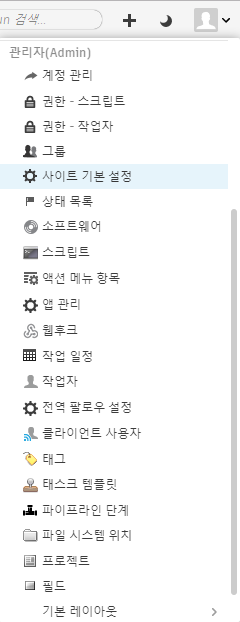
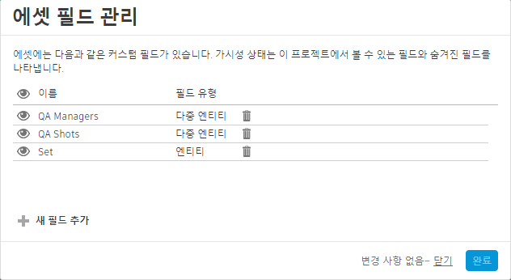
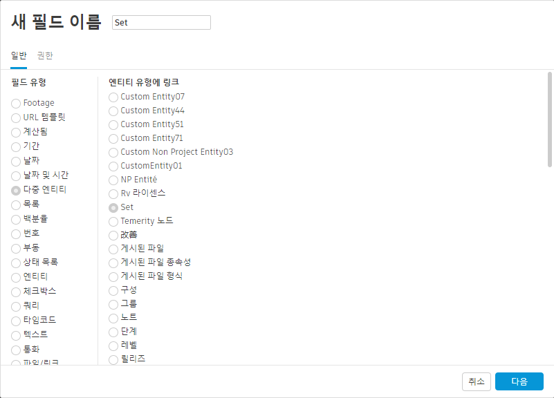
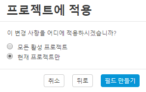
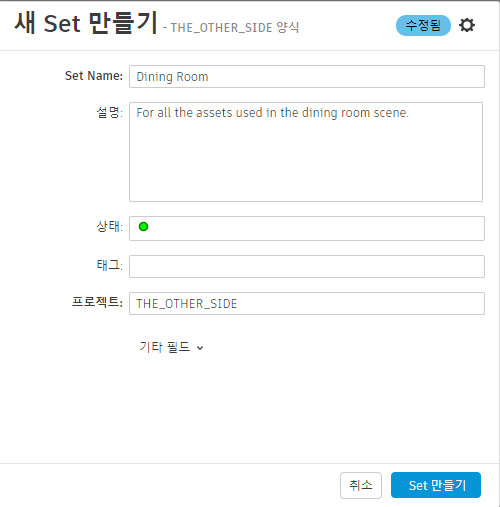
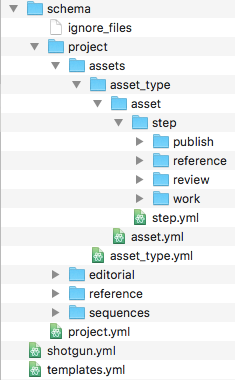
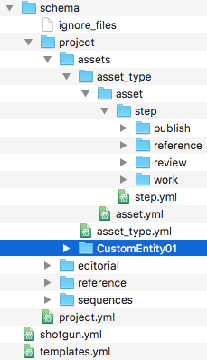
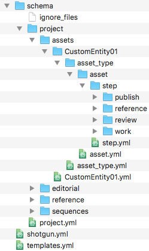
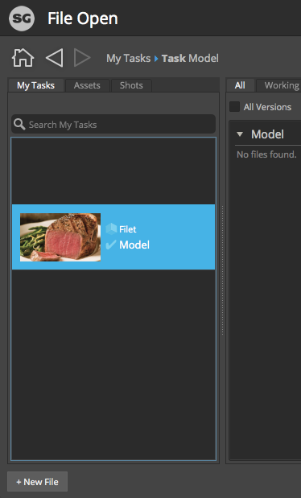
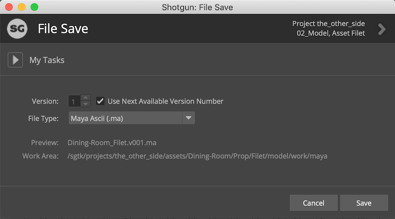

# 동적 파일 시스템 구성

이 안내서에서는 툴킷 파이프라인 구성을 수정하여 프로덕션 폴더 구조와 파일 명명 규칙을 커스터마이즈하는 방법을 설명합니다.

## 안내서 정보

파이프라인 관리의 가장 어려운 점 중 하나는 생성되는 다양한 파일을 추적하는 것입니다. 툴킷 파이프라인은 Shotgun의 데이터 및 구성된 폴더 구조를 기반으로 폴더를 만들고 올바른 위치에 표준화된 명명 규칙을 사용하여 자동으로 파일을 작성하는 방식으로 파일 시스템 관리를 자동화해 주므로 아티스트는 컨텐츠 생성에 집중할 수 있습니다. 파이프라인 구성은 기본 폴더 세트 및 파일 명명 규칙과 함께 제공되지만 프로덕션에서는 이를 커스터마이즈하는 경우가 많습니다. 이 안내서에서는 이러한 커스터마이즈에 필요한 지식을 제공합니다.

기본 구성에서 에셋은 `asset_type/asset/pipeline_step`과 같은 폴더 구조로 관리됩니다. 이 안내서에서는 "Set"라는 커스텀 엔티티를 사용하여 각 에셋이 사용되는 프로덕션 세트별로 에셋을 추가 구성합니다. 먼저 Shotgun에서 커스텀 엔티티를 설정한 다음 이를 사용하여 지정된 세트에 생성된 에셋을 관리합니다. 폴더 구조는 `set/asset_type/asset/pipeline_step`과 같은 형태입니다.

일부 씬은 차고에서 진행되고 나머지 씬은 다이닝룸에서 진행하는 프로젝트를 수행한다고 가정하고 세트별로 에셋을 구성하는 방식을 설명하겠습니다. 설정을 사용하면, "렌치", "기름통" 또는 “작업대"와 같은 에셋에 대한 파일은 "garage" 폴더에 구성되고 "접시", "와인병" 또는 "테이블보"와 같은 에셋에 대한 파일은 "dining_room" 폴더에 구성됩니다. 예제에서 군침 도는 "필레" 에셋은 적절하게 다이닝룸에 배치됩니다.

예제에서는 프로젝트에 대한 파일 명명 템플릿도 편집하여 에셋에 대한 Maya 작업 파일에 해당 이름의 세트가 포함되도록 합니다. 동적으로 생성된 파일 이름은 다이닝룸에 대한 파일과 다른 세트에서 사용된 파일로 구분됩니다.

### 이 안내서는 다음과 같이 세 부분으로 구성됩니다.

* Shotgun에서 "Set"라는 **커스텀 엔티티** 만들기. 아티스트가 만드는 다이닝룸 요소와 연결하는 데 사용됩니다.
* **스키마** 폴더 편집. 툴킷이 폴더 구조에서 현재 세트를 기반으로 동적으로 이름이 지정된 폴더를 포함할 수 있게 합니다.
* 에셋 작업 파일 이름 지정에 사용되는 **템플릿** 편집. 툴킷이 파일 이름에 연관된 세트 이름을 포함할 수 있게 합니다.

### 필수 요건

이 안내서를 사용하려면 다음이 필요합니다.

1. 유효한 [Shotgun](https://www.shotgunsoftware.com/kr/signup/) 사이트. 하나 이상의 에셋이 생성된 프로젝트가 있어야 합니다. 에셋에는 모델 태스크가 있어야 합니다.
2. Shotgun 사이트를 에셋 관리에 사용하는 방법에 대한 기본적인 이해
3. [Shotgun 데스크톱](https://support.shotgunsoftware.com/hc/ko/articles/115000068574-Integrations-user-guide#Installation%20of%20Desktop)이 시스템에 설치되어 있어야 함
4. 식별된 프로젝트에 대한 복제된 파이프라인 구성이나 [구성 시작하기](./advanced_config.md) 안내서를 완료하고 해당 연습에서 생성한 구성 복제
5. YAML에 대한 기본 지식
6. 파이프라인 구성이 저장된 파일 시스템에 대해 읽기 및 쓰기 권한을 적절하게 설정합니다.
7. 툴킷이 프로덕션 파일 시스템에 읽고 쓸 수 있도록 읽기 및 쓰기 권한을 적절하게 설정합니다.
8. 활성 상태의 Maya 멤버쉽. [Maya](https://www.autodesk.co.kr/products/maya/free-trial)의 30일 체험판을 구할 수 있습니다.



### 파일 스키마 및 템플릿 정보

툴킷 파이프라인 구성에서 스키마 및 템플릿을 사용하면 Shotgun 데이터를 활용하여 디스크의 프로덕션 파일을 관리할 수 있습니다. 기본 구성의 스키마에는 **샷**, **시퀀스**, **에셋**, **에셋 유형** 등의 엔티티가 포함됩니다. **레벨**, **에피소드**, **시즌**과 같은 다른 엔티티나 앞에서 설명한 **세트(Set)**같은 커스텀 엔티티를 추가할 수 있습니다.

툴킷 플랫폼을 통해 **스키마**를 사용하여 동적으로 폴더 구조를 빌드할 수 있습니다. 스키마는 실제 프로덕션 파일 시스템을 빌드할 때 템플릿으로 사용되는 프로덕션 폴더 구조의 미니어쳐 버전입니다. 스키마는 동적 폴더 생성을 위한 명시적 지침으로, YAML 파일을 사용하여 동적으로 생성된 폴더의 규칙을 정의합니다. 기본 구성에는 에셋 및 샷 파이프라인에 대한 폴더 생성을 지원하는 사전 구성된 스키마가 포함됩니다. 에셋 폴더 구조(`/assets/<asset_type>/<asset>/<step>`) 생성을 지원하는 스키마 부분을 수정하여 새로 생성하는 **Set** 엔티티도 지원할 수 있습니다.

**템플릿**을 사용하면 Shotgun 데이터 및 스키마 구조의 정보를 사용하여 만든 파일을 동적으로 이름을 지정하고 저장할 수 있습니다. 기본 구성은 파이프라인의 요구에 맞게 편집할 수 있는 일련의 초보자용 템플릿을 제공합니다.



## 연습 시작

스키마 및 템플릿을 커스터마이즈하면 상차림, 뜨거운 필레미뇽, Penfolds Grange Hermitage 1951 와인, 감자 그라탱, 레몬 갈릭 아스파라거스 등 다이닝룸 세트를 만들 때 생성된 파일을 동적으로 관리할 수 있습니다. 다이닝룸 세트에 사용된 에셋은 보다 쉽게 관리할 수 있도록 "Dining Room" Set 엔티티와 연결됩니다. Set는 기본 구성과 함께 제공되는 표준 엔티티 유형이 아니므로 [커스텀 엔티티](https://support.shotgunsoftware.com/hc/ko/articles/114094182834-Enabling-a-custom-entity)를 활성화한 후 스키마 및 템플릿을 확장하기 전에 Set로 지칭해야 사용할 수 있습니다.

### 커스텀 엔티티 활성화하기

**1단계:** 브라우저에서 Shotgun 사이트를 엽니다. 아바타를 클릭하고 관리자(ADMIN) > 사이트 기본 설정(Site Preferences)으로 이동합니다. 결과 페이지에서 **엔티티**(Entities) 섹션을 확장합니다.



Shotgun에서 사용할 수 있는 엔티티 유형 목록이 표시됩니다. 아래 이미지에서 목록 상단에는 현재 Shotgun 사이트에 구성된 일부 엔티티 유형이 있습니다. 이러한 엔티티 유형 아래에는 구성되지 않았거나 활성화되지 않은 몇 가지 **커스텀 엔티티**가 있습니다.

### 커스텀 엔티티 유형 중 하나를 선택하고 구성하고 활성화합니다.


**2단계:** 화살표를 선택하여 회색으로 비활성화된 커스텀 엔티티에 대한 설정을 엽니다. **예, 커스텀 엔티티 사용...**(Yes, use Custom Entity...) 옆의 라디오 버튼을 선택하고 **표시 이름**(Display name)을 **Set**로 변경한 다음 창의 맨 위로 스크롤하여 변경 사항 저장(Save Changes)을 선택합니다.


이렇게 하면 Shotgun에서 해당 커스텀 엔티티가 활성화되고 표시 이름이 *Set*로 표시됩니다. 기본적으로 엔티티의 시스템 이름은 `CustomEntity01`로 유지되므로 커스텀 엔티티에 대한 별칭을 작성합니다. 이 예제에서는 `CustomEntity01`을 사용하지만 다른 커스텀 엔티티를 사용할 수 있습니다.



### 데이터 필드를 추가하여 에셋을 세트와 연결

에셋 엔티티에 데이터 필드를 추가하면 에셋을 새 엔티티에 링크할 수 있습니다. 아티스트가 다이닝룸에 대해 만드는 에셋은 **Dining Room** Set 엔티티와 연결됩니다.

**3단계:** 페이지 맨 위에 있는 **프로젝트**(Projects) 드롭다운을 선택하고 이 연습에서 사용할 프로젝트를 엽니다.

**4단계:** 프로젝트 메뉴 막대에서 **에셋**(Assets)을 선택하여 에셋(Assets) 페이지로 이동합니다. 에셋(Assets) 메뉴에서 **필드(Fields) > 에셋 필드 관리...(Manage Asset Fields…)**를 선택합니다.


그러면 에셋 필드 관리자가 표시됩니다.



**새 필드 추가**(+ Add a new field)를 선택합니다.

새 필드에 대한 매개변수를 선택합니다.

**새 필드 이름**(New Field Name)에 "Set"를 입력합니다. **일반**(GENERAL) 메뉴 아래 **필드 유형**(Field Type)에서 **엔티티**(Entity)를 선택하고 **유형 제한**(Restrict the type)을·스크롤하여 **Set**를 선택합니다. **다음**(Next)을 선택합니다.



이 안내서에서는 이를 **현재 프로젝트만**(Only the current project)으로 적용하고 **필드 만들기**(Create Field)를 선택합니다.

Shotgun이 새 필드를 구성합니다.



변경 사항이 적용되면 **완료**(Done)를 선택할 수 있습니다.

### **Dining Room** Set 엔티티 만들기

**5단계:** 에셋의 새 **Set** 필드를 선택하고 Dining Room을 입력합니다. **일치하는 항목을 찾을 수 없습니다. "Dining Room" 만들기**라고 적힌 대화상자가 표시됩니다.


**"Dining Room" 만들기**(Create “Dining Room”)를 선택합니다.



**Set 만들기**(Create Set)를 선택합니다.

에셋의 Set 필드에 **Dining Room**을 추가하면 Dining Room Set 엔티티와 [연결](https://support.shotgunsoftware.com/hc/ko/articles/115000010973-Linking-a-custom-entity)이 만들어집니다.


**6단계:** 테스트용으로 쉽게 찾을 수 있도록 **필레** 에셋에 대한 모델 태스크를 자신에게 할당합니다.

### 스키마 설정

이제 Set 커스텀 엔티티가 활성화되고 "Dining Room"이라는 Set 엔티티가 만들어지고 에셋 엔티티가 Dining Room Set에 링크되었습니다. Shotgun 사이트에서 모든 부분이 준비되었으며 이제 폴더 구조를 수정할 수 있습니다. 아티스트가 태스크에 대한 작업을 시작하면 툴킷은 연결된 Shotgun 데이터를 사용하여 파일 시스템에 만들 폴더를 결정합니다. 새 폴더가 생성되고 파이프라인 구성 스키마를 기반으로 이름이 자동으로 지정됩니다.

이제 아티스트가 프로덕션 파이프라인을 단계별로 수행할 때 툴킷에서 동적으로 생성할 폴더 구조를 정의할 수 있습니다. 이 작업은 스키마를 편집하여 수행합니다.

{% include info title="참고" content="활성 프로덕션 구성에 영향을 주지 않도록 *복제된* 구성에서 구성을 테스트하는 것이 좋습니다. 복제 프로세스는 구성의 *복사본*을 만들어 변경 사항을 라이브 구성에 적용하기 전에 안전하게 편집할 수 있습니다. 구성 복제에 대한 자세한 내용은 [구성 스테이징 및 롤아웃](https://support.shotgunsoftware.com/hc/ko/articles/219033168-Configuration-staging-and-rollout#Cloning%20your%20Configuration) 문서에서 찾을 수 있습니다." %}

**7단계:** 파이프라인 구성으로 이동합니다. 스키마 폴더(`<pipeline_configuration_root>/config/core/schema`)로 드릴다운하고 `project` 폴더를 엽니다.



현재 스키마는 다음과 같으며

`<project>/assets/<asset_type>/<asset>/<step>`

다음 폴더 구조를 동적으로 만들 수 있습니다.

`the_other_side/assets/prop/filet/model`

여기서는 다음과 같은 구조가 필요합니다.

`the_other_side/assets/Dining-Room/Prop/filet/model`

이렇게 하려면 다음과 같은 스키마를 설정합니다.

`<project>/assets/<CustomEntity01>/<asset_type>/<asset>/<step>`

Set 엔티티는 `CustomEntity01`로 표시됩니다. Shotgun에서 Set의 *표시 이름*으로 CustomEntity01을 제공했지만 구성에서 항상 시스템 이름으로 `CustomEntity01`을 참조합니다.

### 스키마가 YAML 파일을 사용하는 방법

스키마는 정적 및 동적 폴더를 포함할 수 있습니다. "assets"라는 스키마에 정적 폴더가 있는 경우 "assets"라는 프로덕션 파일 시스템의 단일 폴더에 해당합니다. 반면 프로젝트의 각 에셋에 대한 하나의 폴더를 나타내는 "asset"이라는 스키마의 동적 폴더가 있을 수 있습니다. 모든 동적 폴더에는 그 옆에 폴더와 동일한 이름을 가진 YAML 파일이 있습니다(예: `asset/` 및 `asset.yml`). 이 파일은 스키마 폴더를 기반으로 프로덕션 폴더를 생성하는 방법에 대한 규칙을 정의합니다.

### Set 엔티티에 대한 새 폴더 및 YAML 파일 만들기

스키마에는 Shotgun에서 추적하는 다른 엔티티에 대한 폴더가 포함된 `project` 폴더가 있습니다. 새 에셋 엔티티 CustomEntity01을 추가하여 Shotgun에서 Set의 항목을 추적할 수 있도록 합니다. 이러한 항목은 에셋이므로 에셋에서 폴더 및 YAML 파일을 편집할 수 있습니다.

다시 말하지만 우리의 목표는 `asset_type/asset/step` 폴더 구조에서 `set/asset_type/asset/step` 폴더 구조로 바꾸는 것입니다. 따라서 해당 YAML 파일을 사용하여 스키마에서 세트를 나타내는 폴더를 추가하려고 합니다. 커스텀 엔티티에 대한 시스템 이름을 사용해야 하므로 `CustomEntity01/` 폴더와 `CustomEntity01.yml`을 만듭니다.

**8단계:** 스키마의 `project/assets` 폴더 내에 `CustomEntity01` 폴더를 추가합니다.




**9단계:** 다음 내용으로 `CustomEntity01` 폴더 옆에 `CustomEntity01.yml` 파일을 만듭니다.

```
type: "shotgun_entity"

name: "code"

entity_type: "CustomEntity01"

filters:
    - { "path": "project", "relation": "is", "values": [ "$project" ] }
```

YAML 파일은 툴킷에서 `CustomEntity01` 폴더 이름을 무엇으로 지정할지에 대한 지침을 제공합니다. 여기서는 유형이 `shotgun_entity`인 폴더를 만들고 있으며 이는 Shotgun 쿼리에 해당함을 의미합니다. `entity_type` 필드는 Shotgun에서 `CustomEntity01` 엔티티를 쿼리함을 나타내고 `name` 필드는 쿼리할 엔티티에 대한 *필드*를 나타내며 여기서는 `CustomEntity01`에서 `code` 필드를 가져옵니다.

`filters` 필드는 이 동적 폴더를 만들어야 하는 경우를 제한합니다.

**10단계:** `asset_type/` 및 `asset_type.yml`을 `CustomEntity01` 폴더로 이동합니다.

`Dining-Room/Prop/filet`와 같은 폴더 구조가 필요하므로 계층에서 `asset_type` 폴더는 `CustomEntity01` 폴더 *아래*에 있어야 합니다. `asset_type/` 및 `asset_type.yml`을 `CustomEntity01` 폴더로 이동합니다.



### asset.yml 파일 편집

`filters` 필드는 지정 시간에 생성된 폴더가 있는 엔티티를 제한합니다. 현재 상태에서 `asset.yml`의 필터 필드는 다음과 같습니다.

```
filters:
    - { "path": "project", "relation": "is", "values": [ "$project" ] }
    - { "path": "sg_asset_type", "relation": "is", "values": [ "$asset_type"] }
```

에셋에 대한 폴더를 만들기로 결정할 때 올바른 프로젝트 폴더에 있는지 올바른 asset_type 폴더에 있는지 확인하고 싶습니다. 이제 세트 폴더를 추가했으며 세 번째 필터를 추가하려고 합니다. 이 작업을 하지 않고 다음과 같은 폴더로 끝내면 잘못됩니다.

```
assets/Dining-Room/Prop/spoon
assets/Garage/Prop/spoon
assets/Classroom/Prop/spoon
```
그렇게 되지 않도록 세 번째 필터를 추가하면 에셋의 폴더가 올바른 세트의 폴더에만 생성됩니다.

**11단계:** `asset.yml`에서 `filters` 필드를 다음과 같이 수정합니다.

```
filters:
    - { "path": "project", "relation": "is", "values": [ "$project" ] }
    - { "path": "sg_asset_type", "relation": "is", "values": [ "$asset_type"] }
    - { "path": "sg_set", "relation": "is", "values": [ "$CustomEntity04" ] }
```


## 폴더 생성 테스트

이제 Set 커스텀 엔티티별로 에셋을 구성하도록 스키마가 성공적으로 수정되었습니다. 이제 테스트해 보겠습니다.

폴더는 툴킷 파이프라인 워크플로우의 몇 지점에서 생성됩니다.

* **응용프로그램 시작 관리자**: 사용자가 태스크에 대한 DCC를 시작할 때마다 툴킷은 해당 태스크에 대한 디렉토리를 만듭니다(아직 없는 경우). 툴킷을 사용하여 수행하는 첫 번째 작업이 보통 DCC를 시작하는 것이기 때문에 이 방법이 디렉토리를 생성하는 가장 일반적인 방법입니다. 이 작업은 Shotgun 또는 Shotgun 데스크톱이나 Create 앱에서 마우스 오른쪽 버튼 클릭 메뉴를 통해 수행할 수 있습니다.
* **Shotgun 메뉴**: 태스크에 대해 폴더를 만드는 가장 직접적인 방법은 Shotgun에서 태스크를 마우스 오른쪽 버튼으로 클릭하고 "폴더 만들기"(Create Folders) 메뉴 항목을 선택하는 것입니다.
* **툴킷 API**: 툴킷 API를 통해 직접 디렉토리 생성 로직을 트리거할 수 있습니다. 툴킷 API는 커스텀 시작 관리자에 툴킷을 연결하거나, Shotgun에서 샷이 생성될 때 샷에 대한 디렉토리를 자동으로 만들려는 워크플로우의 이벤트 트리거 등에 사용할 수 있습니다.
* **tank 명령**: Shotgun의 메뉴 항목과 유사하며 `tank folders` 터미널 명령도 태스크에 대한 폴더를 만듭니다.

`tank` 명령을 사용하여 테스트하겠습니다.

**12단계:** `filet` 에셋에서 `tank folders`를 실행합니다. 터미널에서 다음을 실행합니다.

```
> cd <pipeline_configuration_root_folder>
>  ./tank Asset Filet folders
```

출력을 요약하면 다음과 같습니다.

```
----------------------------------------------------------------------
Command: Folders
----------------------------------------------------------------------

Creating folders, stand by...

The following items were processed:
 - /Users/michelle/Documents/Shotgun/projects/the_other_side
. . .
 - /Users/michelle/Documents/Shotgun/projects/the_other_side/assets/Dining-Room
 - /Users/michelle/Documents/Shotgun/projects/the_other_side/assets/Dining-Room/Prop
 - /Users/michelle/Documents/Shotgun/projects/the_other_side/assets/Dining-Room/Prop/Filet/
 - /Users/michelle/Documents/Shotgun/projects/the_other_side/assets/Dining-Room/Prop/Filet/model
 - /Users/michelle/Documents/Shotgun/projects/the_other_side/assets/Dining-Room/Prop/Filet/model/publish
. . .

In total, 23 folders were processed.
```

최종 구조는 예상과 일치하며 Dining과 Room 사이에 대시가 추가될 정도로 툴킷이 스마트합니다.

`/the_other_side/assets/Dining-Room/Prop/Filet/model`


### 파일을 읽고 쓰기 위한 툴킷 템플릿

이제 폴더 구조가 설정되었으며 다음 단계는 프로덕션 파일의 이름이 적절하게 지정되고 생성 시 올바른 폴더에 들어가도록 *템플릿*을 편집하는 것입니다.

### 툴킷 앱의 템플릿 사용 방법

먼저 세트를 나타내는 CustomEntity01을 활성화한 다음 에셋 엔티티에 에셋과 세트 간 링크를 나타내는 링크 필드를 추가하면 Shotgun에서 세트와 에셋을 연결할 수 있습니다. 에셋과 세트 간에 관계를 설정한 후 폴더 스키마를 설정하여 해당 연결을 사용해 모든 에셋 *폴더*를 연결된 세트의 폴더 내에 배치합니다. 이제 *파일*의 이름을 동적으로 지정하고 툴킷 앱에서 자동으로 파일을 관리할 수 있습니다.

아티스트가 프로젝트의 태스크 작업을 시작하면 필수 폴더 구조가 생성됩니다. 그러 다음 아티스트가 Workfiles 앱의 **파일 저장**(File Save) 액션을 시작하면 자동으로 파일 이름이 지정됩니다. 툴킷의 Workfiles 앱을 통해 액세스한 템플릿은 해당 파일의 이름을 지정하는 데 사용됩니다. Nuke Write 노드 및 Houdini Mantra 노드와 같은 렌더 앱은 템플릿을 사용하여 렌더링된 파일의 이름을 지정하고 파일을 저장합니다. 게시된 파일의 경우 Publisher 앱에서 수행하는 작업입니다.

Workfiles **파일 열기**(File Open) 액션을 사용하여 파일이 액세스되면 앱은 템플릿을 사용하여 해당 파일을 찾아 로드합니다. Publisher, Loader 및 Nuke Studio Export 앱도 템플릿을 사용하여 파일을 찾고 관리합니다. 아티스트는 파일 이름이나 위치에 대해 걱정할 필요가 없으며 툴킷이 템플릿과 수행할 태스크를 기반으로 모두 관리합니다.

템플릿은 구성 파일 `/<pipeline_configuration_root>/config/core/templates.yml`에 의해 관리됩니다. 마지막 두 안내서에서는 작업 환경에 관련된 설정을 관리하고 만들었습니다. 스키마 및 템플릿 설정은 `config/core` 폴더에 저장되며 환경에 한정되지 않습니다. 모든 템플릿은 단일 파일에 저장되고 다른 환경 구성 파일의 앱 설정 시 이 파일에서 참조됩니다. 예를 들어 `template_work`는 작업 파일에 사용하기 위해 `templates.yml`에서 템플릿을 지정하는 Workfiles 앱의 설정입니다. Workfiles가 구성된 환경 및 엔진에 따라 이 구성 설정을 사용하여 `templates.yml`에서 `maya_shot_work` 템플릿 또는 `houdini_asset_work` 템플릿을 지정할 수 있습니다.

**13단계:** 파이프라인의 구성에서 `config/core/templates.yml`을 엽니다.

이 파일은 다음 세 개의 섹션으로 나뉩니다.

* **키:** 템플릿 작성에 사용할 토큰 세트입니다(예: `{version}`, `{Asset}`, 등). 템플릿이 실제로 사용될 때 실제 값으로 대체됩니다. 각 키에는 필요한 이름과 유형 및 기타 선택적 매개변수가 있습니다.
* **경로:** 키를 사용하여 디스크의 폴더 및 파일에 대한 경로를 나타내는 명명된 문자열입니다. `paths` 섹션의 템플릿은 유효성이 검사되고 디스크에 실제로 존재해야 합니다.
* **문자열:** 경로 섹션과 유사하지만 임의 텍스트에 대한 템플릿입니다. 경로 섹션의 항목은 유효성이 검사되고 디스크의 실제 경로와 일치해야 하며 문자열은 툴킷 워크플로우에서 참조하려는 텍스트 데이터를 저장하는 데 사용할 수 있습니다.

### Set 엔티티에 대한 템플릿 키 추가

가장 먼저 할 일은 엔티티의 시스템 이름을 사용하여 Set 엔티티에 대한 새 키를 정의하는 것입니다.

**14단계:** 들여쓰기에 유의하여 `templates.yml`의 `keys` 섹션에 다음 줄을 추가합니다.

```
       CustomEntity01:
           type: str
```

### 템플릿 수정

템플릿은 툴킷이 파일을 읽고 쓰는 위치를 정의하기 때문에 여기에서 정의한 경로와 스키마에서 정의한 폴더 구조가 일치하는 것이 중요합니다. 결국 프로덕션 파일은 여기에서 생성하는 파일 시스템으로 이동해야 합니다. 따라서 모든 에셋 관련 템플릿을 스키마에서 정의한 새 폴더 구조와 일치하도록 수정합니다.

그런 다음 Maya에서 에셋 단계의 작업 파일에 대한 템플릿을 수정하여 세트도 파일 이름에 포함하도록 합니다. 기본 구성에서 문제의 템플릿은 `maya_asset_work`이며 이 템플릿부터 살펴보겠습니다.



**15단계:** `templates.yml`을 열고 `maya_asset_work`를 찾습니다.

```
   maya_asset_work:
        definition: '@asset_root/work/maya/{name}.v{version}.{maya_extension}'
```

`maya_asset_work`의 `definition` 값은 `@asset_root`로 시작합니다. `@` 기호는 `@asset_root` 값이 다른 곳에서 정의된 것임을 나타냅니다.



각 통합, 각 앱 및 각 환경이 다른 설정을 사용할 수 있기 때문에 경로의 첫 번째 부분은 `templates.yml` 내의 다양한 지점에 사용될 수 있음을 가정할 수 있습니다. 구성은 단일 변수를 사용하여 공통 경로 루트를 저장한 다음 템플릿 내에서 해당 변수를 참조할 수 있도록 설정됩니다. 공통 루트를 참조할 수 있는 경우 경로 생성 설정의 각 인스턴스를 변경할 필요가 없습니다.

기본 구성에는 세 개의 공통 루트 변수 `@shot_root`, `@sequence_root` 및 `@asset_root`가 있습니다. `@asset_root`를 수정하겠습니다. 이렇게 한 번 변경하면 모든 에셋 관련 템플릿에 영향이 미칩니다.

### 템플릿을 파일 시스템 스키마의 경로와 일치하도록 편집

**16단계:** `templates.yml`의 `paths` 섹션 맨 위에서 `asset_root`를 찾습니다. 기본 구성에서는 다음과 같습니다.

`asset_root: assets/{sg_asset_type}/{Asset}/{Step}`

스키마 수정 사항과 일치하도록 `asset_root` 경로에 `CustomEntity01`을 추가합니다.

`asset_root: assets/{CustomEntity01}/{sg_asset_type}/{Asset}/{Step}`

### 파일 이름에 세트 추가

스키마 변경 사항을 반영하도록 파일의 폴더 구조를 변경했으며 이제 적절한 위치에서 파일을 읽고 쓸 수 있습니다. 그럼 이제 Maya 에셋 작업 파일 템플릿에 대한 파일 *이름*에도 세트가 포함되도록 수정하겠습니다.

`maya_asset_work` 템플릿 정의를 다시 찾습니다. 현재 상태에서 파일 *이름*은 다음과 같습니다.

`{name}.v{version}.{maya_extension}`

`{name}` 템플릿 키는 Workfiles 앱의 파일 저장(File Save) 액션에서 사용자 입력을 나타내는 특수 키입니다. 템플릿에 어떤 사용자 입력도 포함하지 않고 대신 현재 세트 및 에셋으로만 구성되도록 수정하겠습니다.

**17단계:** `maya_asset_work` 템플릿 정의를 다음과 같이 수정합니다.

```
    maya_asset_work:
        definition: '@asset_root/work/maya/{CustomEntity01}_{Asset}.v{version}.{maya_extension}'
```

이 액션을 통해 파일 이름에 Dining-Room 엔티티의 적절한 이름을 사용할 수 있습니다. 결과는 `Dining-Room_Filet.v1.mb`와 같이 지정됩니다.

이제 프로덕션 폴더 구조에 새 세트 폴더를 반영하고 Maya에서 에셋 태스크에 대한 작업 파일에 세트 이름을 포함하도록 `templates.yml`이 수정되었습니다. 변경 사항을 테스트해 보겠습니다.

### 테스트

**18단계:** Shotgun 데스크톱에서 Maya를 시작합니다.


Maya에서 **Shotgun > 파일 열기(File Open)**로 이동하여 결과 대화상자에서, Shotgun에서 Set를 지정한 에셋에 대한 태스크를 선택합니다.



**+새 파일**(+New File)을 선택합니다.

간단한 3D 객체를 만들거나 **Shotgun > 파일 저장(Save File)**을 사용하여 파일을 저장할 수 있습니다.



다 되었습니다!

**파일 저장**(File Save) 대화상자에 새 템플릿 설정을 사용하여 **미리보기: Dining-Room_scene.v001.ma**(Preview: Dining-Room_scene.v001.ma)가 표시되어 있습니다.

**작업 영역**(Work Area)에는 Workfiles가 파일을 저장하는 경로인 **.../Shotgun/projects/the_other_side/assets/Dining-Room/Prop/Filet/model/work/maya**가 표시되어 있습니다.

## 고급 항목

### 예제 확장

이 예제에서는 단일 템플릿을 수정했지만 파일 시스템 구성을 사용하여 수행할 수 있는 작업은 훨씬 많습니다. 실제 사례에서는 동일한 파일 명명 규칙을 갖도록 *모든* 에셋 관련 파일을 변경합니다. 다른 엔티티(시즌, 에피소드, 레벨 등)를 기반으로 수정하고, 사용자 폴더를 만들고, 정규 표현식으로 조작된 Shotgun 데이터를 기반으로 폴더 이름을 지정하는 등 많은 작업을 수행할 수 있습니다. 툴킷의 모든 폴더 및 스키마 옵션에 대한 자세한 내용은 [파일 시스템 구성 참조](https://support.shotgunsoftware.com/hc/ko/articles/219039868)를 참조하십시오.

### 경로 캐시

폴더가 생성될 때 디스크의 폴더와 Shotgun 엔티티 간에 매핑이 만들어집니다. 이러한 매핑은 Shotgun에 FilesystemLocation 엔티티로 저장되고 사용자 컴퓨터의 SQLite 데이터베이스에서 캐시됩니다. 경로 캐시 작동 방식과 이를 사용한 작업 방법에 대한 자세한 내용은[이 문서](https://support.shotgunsoftware.com/hc/ko/articles/219040418-What-is-the-Path-Cache-What-are-Filesystem-Locations-)를 참조하십시오.


### 추가 리소스

* [파일 시스템 구성 참조](https://support.shotgunsoftware.com/hc/ko/articles/219039868)
* [툴킷 구성 소개 웨비나 동영상](https://www.youtube.com/watch?v=7qZfy7KXXX0&t=1961s)

